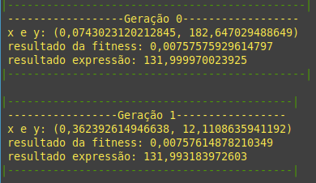
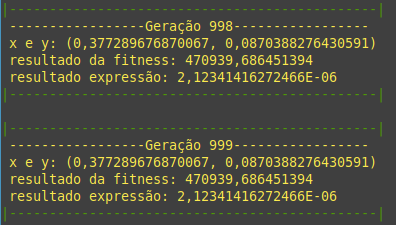

# Inteligencia artificial em C#

### Um exemplo do funcionamento do algoritmo genético na linguagem C# para a resolução de um problema matemático.

--- 

Tabela de conteúdos
====
- [Sobre](#sobre)
- [Imagens](#imagens)
## Sobre

Este projeto foi desenvolvido afim de demonstrar a aplicação do algoritimo genético, sendo utilizado para o desenvolvimento a linguagem C#, o problema a ser resolvido por este algoritmo é a equação abaixo.   

$$
   x^{13} - y^{-2} + 132 = 0
$$

Sendo que a cada geração foi mantido o individuo com o melhor resultado.

---

## Imagens

